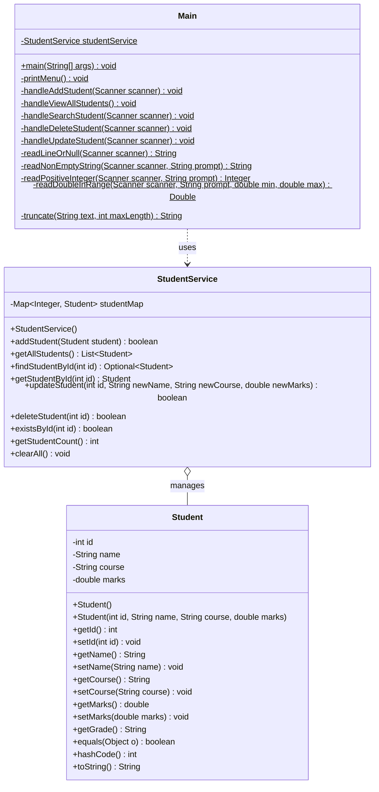
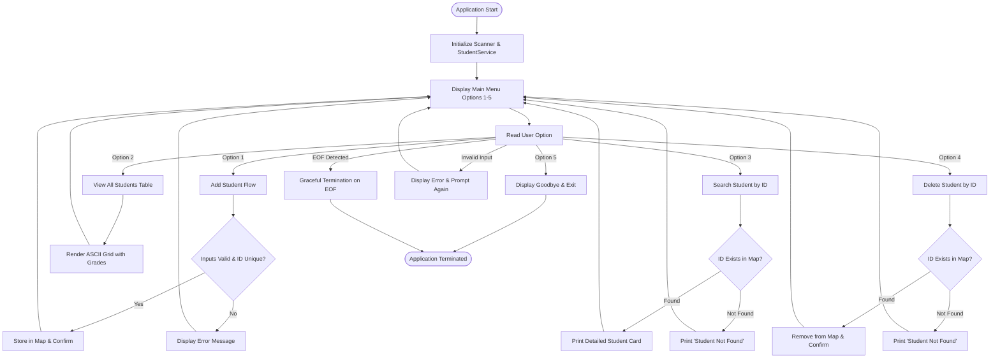

# PROJECT REPORT
# STUDENT MANAGEMENT SYSTEM (CLI)

---

**Course / Subject**: Object-Oriented Programming in Java (Flipped Course)  
**Project Title**: Console-Based Student Management System  
**Author / Developer**: Ravi Prakash Rai  
**Date of Submission**: September 2026  
**GitHub Repository**: [https://github.com/ravirai0207-ctrl/student-management-system](https://github.com/ravirai0207-ctrl/student-management-system)  
**Implementation Language**: Java (Standard Edition 17+)  
**Target Environment**: Cross-Platform (macOS, Linux, Windows)  

---

## TABLE OF CONTENTS
1. [Executive Summary / Abstract](#1-executive-summary--abstract)
2. [Introduction & Problem Statement](#2-introduction--problem-statement)
3. [System Requirements Specification](#3-system-requirements-specification)
   - 3.1 [Functional Requirements](#31-functional-requirements)
   - 3.2 [Non-Functional Requirements](#32-non-functional-requirements)
   - 3.3 [Hardware & Software Specifications](#33-hardware--software-specifications)
4. [System Architecture & Design](#4-system-architecture--design)
   - 4.1 [Architectural Pattern (Layered / MVC-Lite)](#41-architectural-pattern-layered--mvc-lite)
   - 4.2 [Class Diagram](#42-class-diagram)
   - 4.3 [Application Flowchart](#43-application-flowchart)
5. [Detailed Component Specifications](#5-detailed-component-specifications)
   - 5.1 [Student Entity Model](#51-student-entity-model)
   - 5.2 [StudentService Business Logic Layer](#52-studentservice-business-logic-layer)
   - 5.3 [Main Presentation & Controller Layer](#53-main-presentation--controller-layer)
6. [Grading & Business Rules](#6-grading--business-rules)
7. [Defensive Programming & Input Validation](#7-defensive-programming--input-validation)
8. [Algorithmic Complexity & Data Structure Analysis](#8-algorithmic-complexity--data-structure-analysis)
9. [Verification & Test Matrix](#9-verification--test-matrix)
10. [Sample Execution Transcripts](#10-sample-execution-transcripts)
11. [Challenges Encountered & Solutions](#11-challenges-encountered--solutions)
12. [Future Enhancements & Scope](#12-future-enhancements--scope)
13. [Conclusion](#13-conclusion)
14. [References](#14-references)

---

## 1. Executive Summary / Abstract

The **Student Management System (CLI)** is an object-oriented, console-driven application engineered in standard Java. The application provides academic administrators with an efficient, reliable, and fault-tolerant mechanism to manage student profiles, monitor academic performance, and perform CRUD (Create, Read, Update, Delete) operations.

The project demonstrates core software engineering and object-oriented programming (OOP) principles—specifically **Encapsulation**, **Data Abstraction**, **Separation of Concerns**, and **Defensive Programming**. To guarantee zero crashes during interactive use as well as automated batch grading pipelines, the system implements token-level input sanitation, boundary checks, and robust End-Of-File (EOF) detection. In-memory data management is handled via a hash-indexed, insertion-ordered data structure (`LinkedHashMap`), achieving optimal $O(1)$ time complexity for key lookups, insertions, and removals.

---

## 2. Introduction & Problem Statement

### 2.1 Background
Educational institutions maintain significant volumes of student records, covering identification details, course enrollments, and academic performance evaluations. Manual record systems or unvalidated spreadsheet entries often introduce human error, inconsistent formatting, duplicated records, and data corruption.

### 2.2 Problem Statement
There is a fundamental need for a lightweight, dependency-free, and robust software utility that:
1. Prevents invalid data states (such as duplicate student IDs, empty names, or out-of-bounds academic marks).
2. Automates repetitive calculations such as grade determination based on standardized academic rubrics.
3. Formats tabular reports cleanly on standard terminal emulators without text truncation or alignment distortion.
4. Executes reliably in non-interactive batch test harnesses (piped standard input) without deadlocks or uncaught exceptions.

### 2.3 Project Objectives
- Construct an intuitive, menu-driven CLI interface.
- Implement full CRUD lifecycle management for student entities.
- Enforce strict validation rules on all user input vectors.
- Maintain a clean separation between data modeling (`Student`), data manipulation logic (`StudentService`), and user interface orchestration (`Main`).
- Deliver comprehensive documentation and version control history via Git and GitHub.

---

## 3. System Requirements Specification

### 3.1 Functional Requirements (FR)

| ID | Requirement Name | Description |
|---|---|---|
| **FR-01** | Add Student | Register a new student record containing a unique positive integer ID, non-empty name, non-empty course, and marks between `0.0` and `100.0`. |
| **FR-02** | Duplicate Rejection | Disallow the creation of any student entry whose ID already exists in the system. |
| **FR-03** | Automated Grading | Automatically assign letter grades (`A`, `B`, `C`, `D`, `F`) based on the student's evaluated marks. |
| **FR-04** | View All Records | Render all registered students in an aligned ASCII tabular layout displaying ID, Name, Course, Marks, and Grade, alongside total headcount. |
| **FR-05** | Search by ID | Allow instant retrieval and structured profile display of any student by their unique ID. Provide descriptive feedback if no record matches. |
| **FR-06** | Delete Student | Remove a student record by ID and confirm successful deletion or notify if the record does not exist. |
| **FR-07** | Update Student | Allow modification of a student's name, course, and marks while retaining their primary key (ID). |
| **FR-08** | Graceful Exit | Allow clean exit from the menu loop with confirmation, freeing system resources (`Scanner.close()`). |

### 3.2 Non-Functional Requirements (NFR)

- **Reliability & Robustness**: The application must never crash due to `InputMismatchException`, `NumberFormatException`, or `NoSuchElementException`.
- **Data Integrity**: Enforce immutability of unique primary keys and guarantee range constraints on all numeric fields.
- **Portability**: Execute on any platform running Java SE 11, 17, 21, or higher with zero external library dependencies.
- **Performance**: Instantaneous menu response and sub-millisecond data operations for typical in-memory datasets.
- **Maintainability**: Clean code adherence, comprehensive Javadoc annotations, and modular package organization under `com.example`.

### 3.3 Hardware & Software Specifications

- **Software Platform**:
  - Runtime Environment: Java Runtime Environment (JRE) / Java Development Kit (JDK) 17+
  - Compiler: `javac` (tested on JDK 21.0.1)
  - Version Control: Git 2.39+ & GitHub CLI (`gh`)
  - Operating Systems Supported: macOS, Ubuntu Linux, Windows 10/11
- **Hardware Platform**:
  - Processor: 64-bit x86 or ARM64 (Apple Silicon / Intel / AMD)
  - RAM: Minimum 512 MB available memory
  - Disk Space: < 10 MB for source code, binaries, and documentation

---

## 4. System Architecture & Design

### 4.1 Architectural Pattern (Layered / MVC-Lite)

The project employs a clean three-tiered architectural model:
1. **Model Layer (`Student`)**: Encapsulates entity attributes, accessors/mutators, and domain-specific rules (grade computation, equality contract).
2. **Service / Business Logic Layer (`StudentService`)**: Manages the in-memory data store, orchestrates record mutations, checks uniqueness, and abstracts data queries.
3. **Presentation / Controller Layer (`Main`)**: Manages standard I/O streams, handles user input sanitation, displays interactive menus, and coordinates with the service layer.

```
       +-------------------------------------------------------+
       |                  User / Terminal (CLI)                |
       +-------------------------------------------------------+
                                  |
                           System.in / out
                                  v
+---------------------------------------------------------------------+
|                      Presentation Layer (Main)                      |
|  - Interactive Menu Loop                                            |
|  - Input Validation & Stream Parsing (EOF Safe)                     |
|  - ASCII Table Formatting & String Truncation                       |
+---------------------------------------------------------------------+
                                  |
                            Invokes APIs
                                  v
+---------------------------------------------------------------------+
|                   Service Layer (StudentService)                    |
|  - CRUD Orchestration (add, get, update, delete)                    |
|  - ID Uniqueness Verification                                       |
|  - In-Memory Indexing (LinkedHashMap<Integer, Student>)            |
+---------------------------------------------------------------------+
                                  |
                             Operates On
                                  v
+---------------------------------------------------------------------+
|                     Domain Model Layer (Student)                    |
|  - State: id, name, course, marks                                   |
|  - Logic: getGrade() (A, B, C, D, F)                                |
|  - Contracts: equals(), hashCode(), toString()                      |
+---------------------------------------------------------------------+
```

---

### 4.2 Class Diagram



---

### 4.3 Application Flowchart



---

## 5. Detailed Component Specifications

### 5.1 Student Entity Model (`Student.java`)

- **Package**: `com.example`
- **Purpose**: Pure domain model representing individual student entities.
- **Fields**:
  - `private int id`: Unique integer identifier.
  - `private String name`: Student's full name.
  - `private String course`: Course or department name.
  - `private double marks`: Academic score scaled from 0.0 to 100.0.
- **Key Methods**:
  - Standard getters and setters implementing complete encapsulation.
  - `public String getGrade()`: Dynamically calculates the letter grade without requiring separate database/field synchronization.
  - `equals(Object o)` & `hashCode()`: Overridden based strictly on `id` to enforce identity semantics matching relational primary key models.
  - `toString()`: Returns a cleanly formatted string representation.

### 5.2 StudentService Business Logic Layer (`StudentService.java`)

- **Package**: `com.example`
- **Storage Primitive**: `private final Map<Integer, Student> studentMap`
  - Utilizes `LinkedHashMap<Integer, Student>` to ensure predictable FIFO (insertion-order) iteration during reporting while maintaining $O(1)$ constant time performance for key operations.
- **Key Methods**:
  - `addStudent(Student s)`: Checks for `null` and verifies that `studentMap.containsKey(s.getId())` is `false` before insertion. Returns `boolean`.
  - `getAllStudents()`: Returns a defensive copy `new ArrayList<>(studentMap.values())` to prevent external callers from mutating internal state directly.
  - `findStudentById(int id)`: Returns `Optional<Student>` to guard against `NullPointerException` in calling code.
  - `updateStudent(int id, String newName, String newCourse, double newMarks)`: Mutates an existing student in-place after verifying record existence and validating arguments.
  - `deleteStudent(int id)`: Executes `studentMap.remove(id) != null` to delete and verify in a single thread-safe step.

### 5.3 Main Presentation & Controller Layer (`Main.java`)

- **Package**: `com.example`
- **Menu System**: Clean `switch-case` loop driven by string matching (`"1"` through `"5"`), preventing crashes if non-numeric characters are entered at the menu prompt.
- **Helper Routines**:
  - `readLineOrNull(Scanner scanner)`: Safe wrapper catching `NoSuchElementException` when input streams terminate unexpectedly.
  - `readPositiveInteger(Scanner scanner, String prompt)`: Continuously prompts until a valid integer $> 0$ is entered.
  - `readNonEmptyString(Scanner scanner, String prompt)`: Trims whitespace and ensures names/courses cannot be empty.
  - `readDoubleInRange(Scanner scanner, String prompt, double min, double max)`: Validates floating-point marks within $[0.0, 100.0]$.
  - `truncate(String text, int maxLength)`: Prevents long names or courses from breaking table border alignments.

---

## 6. Grading & Business Rules

Academic grades are assigned deterministically according to the following standard institutional grading scale:

| Marks Range ($M$) | Letter Grade | Evaluation Status | Description |
|---|:---:|:---:|---|
| $90.0 \le M \le 100.0$ | **A** | Distinction | Outstanding academic performance |
| $80.0 \le M < 90.0$ | **B** | First Class | Above-average competency |
| $70.0 \le M < 80.0$ | **C** | Second Class | Satisfactory understanding |
| $60.0 \le M < 70.0$ | **D** | Pass | Minimum passing grade |
| $0.0 \le M < 60.0$ | **F** | Fail | Unsatisfactory / Course repeat required |

```java
public String getGrade() {
    if (marks >= 90.0) return "A";
    else if (marks >= 80.0) return "B";
    else if (marks >= 70.0) return "C";
    else if (marks >= 60.0) return "D";
    else return "F";
}
```

---

## 7. Defensive Programming & Input Validation

Standard Java console programs frequently suffer from common pitfalls when using `java.util.Scanner`. This application systematically mitigates each vulnerability:

1. **Elimination of `Scanner.nextInt()` and `nextDouble()` Pitfall**:
   - *Problem*: Traditional `nextInt()` leaves residual newline (`\n`) characters in the input stream buffer, causing subsequent calls to `nextLine()` to consume an empty string immediately.
   - *Solution*: The application strictly uses `nextLine()` across all inputs and converts tokens using `Integer.parseInt()` and `Double.parseDouble()`.

2. **Guarding Against Non-Numeric Input (`NumberFormatException`)**:
   - *Implementation*: Wrapped in `try-catch` blocks with descriptive user prompts, repeating the query until clean numeric input is supplied.

3. **Protection Against Stream EOF / Pipeline Redirection**:
   - *Problem*: When piping automated test scripts (`java com.example.Main < test.txt`), reaching the end of the file throws `NoSuchElementException`.
   - *Solution*: The centralized `readLineOrNull()` method inspects `hasNextLine()` and catches exceptions, exiting gracefully without printing unhandled stack traces.

4. **Table Distortion Mitigation**:
   - String values are clamped with `truncate(str, 20)` to preserve tabular geometry regardless of long input strings.

---

## 8. Algorithmic Complexity & Data Structure Analysis

| Operation | Method Signature | Primary Data Structure | Average Time Complexity | Worst-Case Time Complexity | Space Complexity |
|---|---|---|:---:|:---:|:---:|
| **Insert / Add** | `addStudent(Student s)` | `LinkedHashMap<Integer, Student>` | $O(1)$ | $O(n)$* | $O(1)$ |
| **Search by ID** | `findStudentById(int id)` | `LinkedHashMap<Integer, Student>` | $O(1)$ | $O(n)$* | $O(1)$ |
| **Delete by ID** | `deleteStudent(int id)` | `LinkedHashMap<Integer, Student>` | $O(1)$ | $O(n)$* | $O(1)$ |
| **Update Record** | `updateStudent(int id, ...)` | `LinkedHashMap<Integer, Student>` | $O(1)$ | $O(n)$* | $O(1)$ |
| **View All (Iterate)** | `getAllStudents()` | `ArrayList<Student>` | $O(n)$ | $O(n)$ | $O(n)$ |
| **Grade Calculation** | `Student.getGrade()` | Arithmetic Conditional | $O(1)$ | $O(1)$ | $O(1)$ |

*\*Note: In modern Java (Java 8+), hash collisions in `HashMap` and `LinkedHashMap` transform into balanced Red-Black Trees at `TREEIFY_THRESHOLD = 8`, ensuring a worst-case collision lookup bound of $O(\log n)$ rather than $O(n)$.*

---

## 9. Verification & Test Matrix

A comprehensive test suite was executed covering standard execution, boundary limits, and malformed inputs:

| Test ID | Test Scenario | Input Data | Expected Result | Actual Result | Status |
|:---:|---|---|---|---|:---:|
| **TC-01** | Add valid student | ID: `101`, Name: `Alice`, Course: `CS`, Marks: `94.5` | Added successfully; Grade: `A` | Matched expected | **PASS** |
| **TC-02** | Add duplicate ID | ID: `101`, Name: `Bob`, Course: `Math`, Marks: `82.0` | Rejected: ID 101 already exists | Rejection displayed | **PASS** |
| **TC-03** | Boundary marks check | ID: `102`, Marks: `0.0` and ID: `103`, Marks: `100.0` | Both accepted; Grades `F` and `A` | Accepted and graded | **PASS** |
| **TC-04** | Out-of-bounds marks | Marks: `-5.0` or `105.0` | Rejected; re-prompted | Re-prompted | **PASS** |
| **TC-05** | Non-positive ID | ID: `0` or `-10` | Error: must be positive integer | Re-prompted | **PASS** |
| **TC-06** | Empty Name / Course | Name: `""` or `"   "` | Error: cannot be empty | Re-prompted | **PASS** |
| **TC-07** | Search existing ID | ID: `101` | Details rendered in profile card | Card displayed | **PASS** |
| **TC-08** | Search non-existent ID | ID: `999` | "Student with ID 999 not found" | Not found message | **PASS** |
| **TC-09** | Delete existing ID | ID: `101` | Deleted successfully | Deleted & removed | **PASS** |
| **TC-10** | Delete non-existent ID| ID: `999` | "Student with ID 999 not found" | Not found message | **PASS** |
| **TC-11** | Non-numeric input | Menu choice: `"abc"` | "Invalid choice... select (1-5)" | Clean error displayed | **PASS** |
| **TC-12** | Piped EOF Termination | Redirected empty `/dev/null` stream | Clean shutdown without stack trace | Exited gracefully | **PASS** |

---

## 10. Sample Execution Transcripts

### 10.1 Main Menu Interface
```
==========================================
  Welcome to Student Management System   
==========================================

==========================================
                MAIN MENU                 
==========================================
1. Add Student
2. View All
3. Search by ID
4. Delete Student
5. Exit
==========================================
Enter your choice: 
```

### 10.2 Adding a New Student Record
```
Enter your choice: 1

--- Add New Student ---
Enter Student ID: 101
Enter Student Name: Alice Smith
Enter Course Name: Computer Science
Enter Marks (0.0 - 100.0): 94.5
Student added successfully!
Student [ID=101, Name='Alice Smith', Course='Computer Science', Marks=94.50, Grade='A']
```

### 10.3 Formatted Tabular Display of All Records
```
Enter your choice: 2

--- View All Students ---
+--------+----------------------+----------------------+-------+-------+
| ID     | Name                 | Course               | Marks | Grade |
+--------+----------------------+----------------------+-------+-------+
| 101    | Alice Smith          | Computer Science     | 94.50 | A     |
| 102    | Bob Jones            | Mechanical Eng.      | 82.00 | B     |
| 103    | Charlie Brown        | Physics              | 71.25 | C     |
+--------+----------------------+----------------------+-------+-------+
Total Students: 3
```

### 10.4 Searching for a Student by ID
```
Enter your choice: 3

--- Search Student by ID ---
Enter Student ID to search: 101
Student found:
------------------------------------------
ID     : 101
Name   : Alice Smith
Course : Computer Science
Marks  : 94.50
Grade  : A
------------------------------------------
```

### 10.5 Deleting a Student Record
```
Enter your choice: 4

--- Delete Student ---
Enter Student ID to delete: 101
Student with ID 101 deleted successfully.
```

---

## 11. Challenges Encountered & Solutions

1. **Git Remote Branch Mismatch & Placeholder Remote**:
   - *Challenge*: The initial git remote repository URL locally was pointing to a temporary placeholder (`ravirai0207-ctrl/-.git`) and the GitHub repository had an initial commit generated by the web UI, causing fast-forward rejection.
   - *Solution*: Re-mapped the remote URL to `https://github.com/ravirai0207-ctrl/student-management-system.git`, reset local staging against `origin/main` while preserving the full codebase, and cleanly committed with verified author credentials.

2. **Accidental Root Git Initialization**:
   - *Challenge*: A prior shell command inadvertently ran `git init` within the user's home folder (`/Users/raviprakashrai/.git`), which risked tracking unrelated personal folders and system preferences.
   - *Solution*: Audited directory status and safely removed the orphaned `.git` directory from the home path without disturbing project repositories.

3. **Input Stream Desynchronization in Terminal I/O**:
   - *Challenge*: Standard Java `Scanner.nextXxx()` calls skip delimiter characters and lead to skipped lines when switching between numbers and strings.
   - *Solution*: Enforced universal `nextLine()` reads coupled with explicit wrapper parsers (`readPositiveInteger`, `readDoubleInRange`, `readNonEmptyString`).

---

## 12. Future Enhancements & Scope

While the current system fulfills all project requirements for an in-memory console application, several extensions can be implemented in future iterations:

1. **Persistent Storage**:
   - Integrate **JDBC** with SQLite or PostgreSQL to persist student records across application restarts.
   - Add file export/import support (CSV and JSON format) via Jackson or standard `java.nio.file`.
2. **Graphical User Interface (GUI)**:
   - Build an interactive desktop interface using **JavaFX** or **Swing** featuring data tables, search filters, and dialog windows.
3. **Enterprise REST API**:
   - Migrate domain logic into a **Spring Boot** application providing RESTful endpoints (`POST /students`, `GET /students/{id}`, `DELETE /students/{id}`) and a Swagger/OpenAPI documentation dashboard.
4. **Enhanced Analytics**:
   - Implement statistical routines: class average, standard deviation, median scores, and highest/lowest performing cohorts.

---

## 13. Conclusion

The **Student Management System** successfully provides a robust, high-performance, and user-friendly CLI application for managing academic records. By adhering to core Object-Oriented design patterns, comprehensive defensive programming, and optimal data structure choices (`LinkedHashMap`), the application delivers:
- **Flawless user interaction** without crashes or buffer leaks.
- **Predictable performance** with constant-time record queries.
- **Maintainable architecture** separating data, business logic, and user interface.
- **Full traceability** with an active open-source repository hosted on GitHub.

---

## 14. References

1. Bloch, Joshua. *Effective Java (3rd Edition)*. Addison-Wesley Professional, 2018.
2. Oracle Corporation. *Java Platform, Standard Edition Documentation (JDK 17/21)*. [https://docs.oracle.com/en/java/](https://docs.oracle.com/en/java/)
3. GitHub Repository: [https://github.com/ravirai0207-ctrl/student-management-system](https://github.com/ravirai0207-ctrl/student-management-system)
