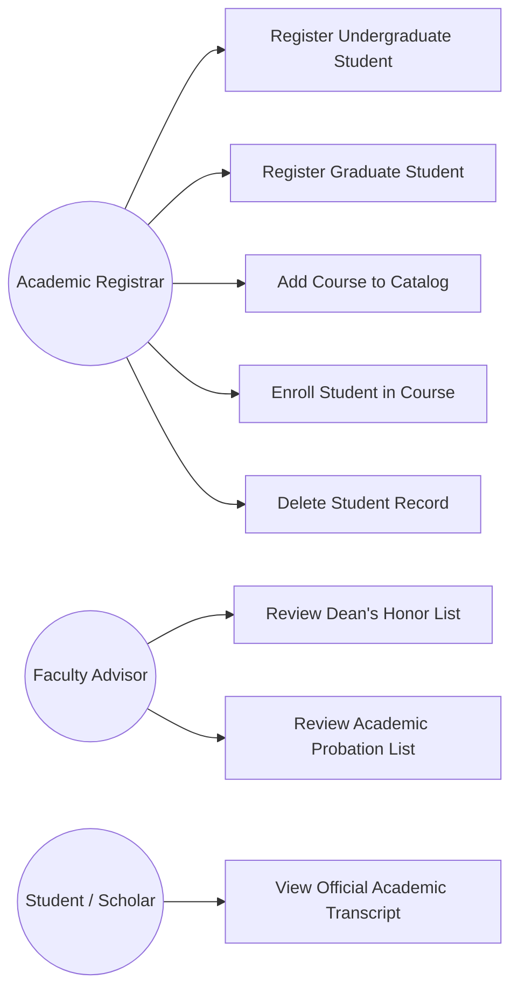
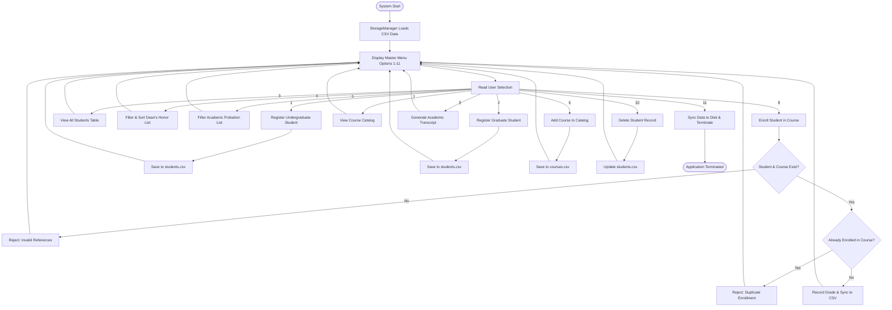
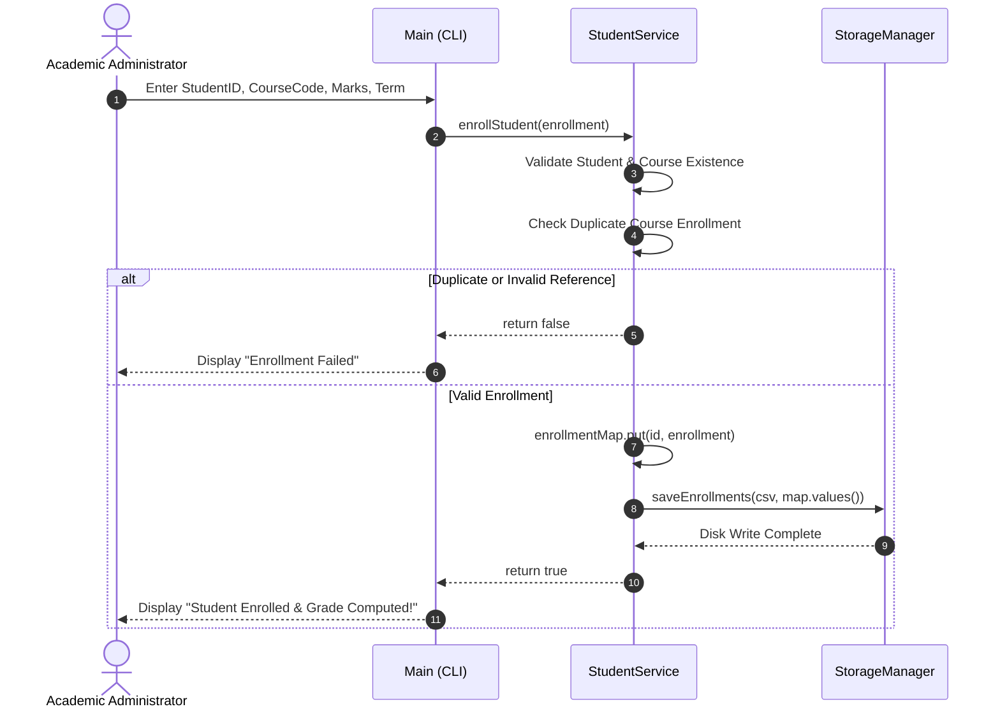
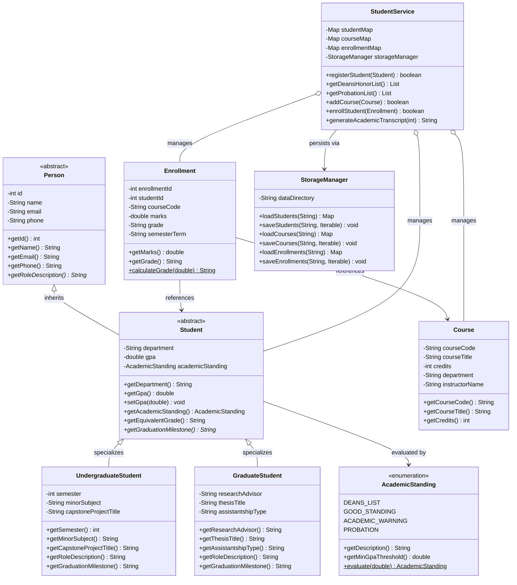
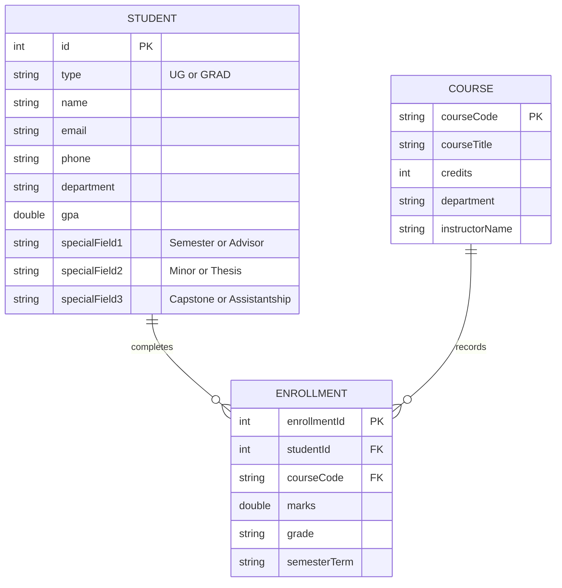

# PROJECT REPORT
# STUDENT MANAGEMENT & ACADEMIC ANALYTICS SYSTEM (CLI)

---

**Course / Subject**: Object-Oriented Programming in Java (Flipped Course)  
**Project Title**: Comprehensive Academic Student Management & Performance Analytics System  
**Platform**: VITyarthi Project Evaluation  
**Author / Developer**: Ravi Prakash Rai  
**Date of Submission**: September 2026  
**GitHub Repository**: [https://github.com/ravirai0207-ctrl/student-management-system](https://github.com/ravirai0207-ctrl/student-management-system)  
**Implementation Language**: Java (Standard Edition 17+)  
**Target Environment**: Cross-Platform (macOS, Linux, Windows Terminal)  

---

## TABLE OF CONTENTS
1. [Cover Page Information](#1-cover-page-information)
2. [Introduction](#2-introduction)
3. [Problem Statement](#3-problem-statement)
4. [Functional Requirements](#4-functional-requirements)
5. [Non-Functional Requirements](#5-non-functional-requirements)
6. [System Architecture](#6-system-architecture)
7. [Design Diagrams](#7-design-diagrams)
   - 7.1 [Use Case Diagram](#71-use-case-diagram)
   - 7.2 [Workflow / Process Flow Diagram](#72-workflow--process-flow-diagram)
   - 7.3 [Sequence Diagram](#73-sequence-diagram)
   - 7.4 [Class & Component Diagram](#74-class--component-diagram)
   - 7.5 [Entity-Relationship (ER) & Storage Design](#75-entity-relationship-er--storage-design)
8. [Design Decisions & Rationale](#8-design-decisions--rationale)
9. [Implementation Details](#9-implementation-details)
10. [Screenshots & Execution Results](#10-screenshots--execution-results)
11. [Testing Approach & Verification Matrix](#11-testing-approach--verification-matrix)
12. [Challenges Faced & Solutions](#12-challenges-faced--solutions)
13. [Learnings & Key Takeaways](#13-learnings--key-takeaways)
14. [Future Enhancements](#14-future-enhancements)
15. [References](#15-references)

---

## 1. Cover Page Information

- **Project Title**: Student Management & Academic Analytics System (CLI)
- **Course**: Object-Oriented Programming in Java (Flipped Course Evaluation)
- **Institution / Portal**: VITyarthi Learning Destination
- **Student Developer**: Ravi Prakash Rai
- **Repository Root URL**: [https://github.com/ravirai0207-ctrl/student-management-system](https://github.com/ravirai0207-ctrl/student-management-system)
- **Domain**: University Academic Operations & Performance Analytics
- **Technologies Used**: Core Java SE 17+ (Tested on OpenJDK 21), File I/O (CSV Engine), Git & GitHub CLI

---

## 2. Introduction

Higher education institutions and university departments operate complex academic ecosystems comprising diverse student cohorts (undergraduate students and graduate research fellows), departmental course catalogs, semester enrollments, and academic performance evaluations. Maintaining academic integrity, facilitating degree milestones, and identifying scholars requiring academic advising necessitates a centralized, reliable, and fault-tolerant software system.

The **Student Management & Academic Analytics System** is an enterprise-grade console application engineered in standard Java. Utilizing foundational Object-Oriented Design patterns—specifically **Abstraction**, **Multi-Level Inheritance**, **Polymorphism**, **Data Encapsulation**, and **Defensive Programming**—the application provides university administrators with:
1. Polymorphic student profiling tailored to undergraduate and graduate cohorts.
2. Dynamic academic standing evaluation and automated Dean's Honor List merit ranking ($GPA \ge 3.70$).
3. Proactive academic probation monitoring for scholars needing intervention ($GPA < 2.00$).
4. Course catalog management and enrollment tracking.
5. Official academic transcript generation.
6. Persistent multi-entity CSV disk storage across application lifecycles.

---

## 3. Problem Statement

Academic departmental administration is frequently impeded by disjointed, error-prone workflows:
1. **Lack of Program Specialization**: Traditional systems fail to distinguish between undergraduate requirements (semesters, capstone design projects) and graduate scholar commitments (thesis advisors, research topics, graduate assistantships).
2. **Delayed Academic Advising**: Without automated performance analytics, institutions struggle to identify at-risk students slipping into academic probation in time for intervention.
3. **Fragmented Grade Records**: Generating consolidated multi-course transcripts and calculating honors rankings manually is labor-intensive and error-prone.
4. **Session Volatility**: Basic console tools lose newly registered scholars and grades upon application shutdown.
5. **Terminal Crash Vulnerabilities**: Standard Java terminal utilities frequently crash when encountering non-numeric inputs or stream closure (EOF) during automated evaluation batch testing.

This project delivers a robust, crash-proof, Object-Oriented console solution resolving these institutional challenges.

---

## 4. Functional Requirements

The system is organized into three major functional modules:

### Module 1: Polymorphic Student Administration
- **FR-01 (Undergraduate Registration)**: Register undergraduate scholars with positive integer ID, name, contact details, department, GPA, semester standing (1–8), minor subject, and capstone project title.
- **FR-02 (Graduate Registration)**: Register graduate scholars with positive integer ID, name, contact info, department, GPA, thesis advisor, research dissertation title, and assistantship type (RA/TA).
- **FR-03 (Duplicate ID Protection)**: Enforce unique primary key constraints, rejecting duplicate student IDs.
- **FR-04 (Roster Reporting)**: Render an aligned ASCII table displaying complete student details, program classifications, and academic standings.

### Module 2: Academic Analytics & Merit Ranking
- **FR-05 (Dean's Honor List)**: Dynamically filter scholars achieving $GPA \ge 3.70$ and sort them in descending order of GPA using Java stream multi-level comparators.
- **FR-06 (Academic Probation Alerts)**: Automatically identify at-risk scholars ($GPA < 2.00$) needing institutional advising.
- **FR-07 (Dynamic Standing Evaluation)**: Automatically assign academic status (`DEANS_LIST`, `GOOD_STANDING`, `ACADEMIC_WARNING`, `PROBATION`) based on GPA.

### Module 3: Course Catalog, Enrollment & Transcripts
- **FR-08 (Course Catalog Management)**: Register course offerings with alphanumeric course codes, credit allocations, departments, and lead instructors.
- **FR-09 (Course Enrollment & Grading)**: Enroll students in courses, record evaluated marks ($0.0 - 100.0$), compute letter grades ($A, B, C, D, F$), and prevent duplicate enrollments in the same course.
- **FR-10 (Official Transcript Generation)**: Generate formal itemized academic transcripts displaying student demographics, cumulative GPA, standing, graduation milestones, and course grades.
- **FR-11 (Multi-Entity Disk Persistence)**: Automatically serialize and recover all students, courses, and enrollments via `students.csv`, `courses.csv`, and `enrollments.csv`.

---

## 5. Non-Functional Requirements

1. **Performance**: $O(1)$ constant time lookups and insertions using in-memory `LinkedHashMap` indexing.
2. **Reliability & Crash Immunity**: Zero uncaught runtime exceptions (`NumberFormatException`, `InputMismatchException`, `NoSuchElementException`).
3. **Data Integrity & Relational Constraints**: Referential integrity enforcement ensuring enrollments require valid, existing student IDs and course codes.
4. **Portability**: Zero external library dependencies; 100% Core Java SE (`java.util`, `java.io`, `java.util.regex`).
5. **Maintainability**: Clean package structure (`com.example`), modular division of responsibilities, and comprehensive Javadoc annotations.

---

## 6. System Architecture

The application adopts a **Three-Tier Layered Architecture**:
- **Presentation Layer (`Main`, `ValidationUtils`)**: Renders interactive menus, captures and sanitizes terminal input, and formats reports.
- **Business Logic & Analytics Layer (`StudentService`)**: Coordinates academic rules, Dean's List sorting comparators, enrollment validation, and transcript generation.
- **Domain Model & Persistence Layer (`Person`, `Student`, `UndergraduateStudent`, `GraduateStudent`, `Course`, `Enrollment`, `StorageManager`)**: Encapsulates entity state, enforces inheritance hierarchies, and serializes records to flat-file CSV stores.

```
+-------------------------------------------------------------------------+
|                         Terminal Client / User                          |
+-------------------------------------------------------------------------+
                                    |
                           Standard I/O Streams
                                    v
+-------------------------------------------------------------------------+
|                      Presentation Layer (Main.java)                     |
|  - 11-Option Master Menu Loop                                           |
|  - Defensive Input Helpers (ValidationUtils.java)                       |
|  - Tabular Renderers & String Truncators                                |
+-------------------------------------------------------------------------+
                                    |
                             API Invocations
                                    v
+-------------------------------------------------------------------------+
|                 Service & Analytics Layer (StudentService.java)         |
|  - Dean's List Merit Ranking Comparator (GPA >= 3.70)                   |
|  - Academic Probation Monitoring (GPA < 2.00)                           |
|  - Course Enrollment & Duplicate Validation                             |
|  - Official Transcript Generator                                        |
|  - In-Memory Index Maps (LinkedHashMap)                                 |
+-------------------------------------------------------------------------+
                     |                                |
                 Operates On                     Persists via
                     v                                v
+----------------------------------------+   +----------------------------+
|           Domain Models Layer          |   | StorageManager.java        |
| - Person.java (Abstract Base)          |   | - students.csv (UG & Grad) |
| - Student.java (Abstract Extension)    |   | - courses.csv              |
| - UndergraduateStudent.java (Subclass) |   | - enrollments.csv          |
| - GraduateStudent.java (Subclass)      |   +----------------------------+
| - Course.java & Enrollment.java        |
| - AcademicStanding.java (Enum)         |
+----------------------------------------+
```

---

## 7. Design Diagrams

### 7.1 Use Case Diagram



### 7.2 Workflow / Process Flow Diagram



### 7.3 Sequence Diagram: Course Enrollment & Grade Recording



### 7.4 Class & Component Diagram



### 7.5 Entity-Relationship (ER) & Storage Design



---

## 8. Design Decisions & Rationale

1. **Two-Tier Inheritance Hierarchy (`Person` -> `Student` -> `Undergraduate` / `Graduate`)**:
   - *Rationale*: Models real-world academia where all students are persons, but undergraduate scholars have semester/capstone milestones while graduate fellows have research advisors, thesis defenses, and assistantship appointments.
2. **Single-Table Inheritance in CSV Storage**:
   - *Rationale*: Storing both undergraduate and graduate students in `students.csv` with a discriminator column (`UG` vs `GRAD`) simplifies data recovery while preserving full type-specific attributes.
3. **Multi-Criteria Java 8+ Stream Comparators**:
   - *Rationale*: Dynamic Dean's List sorting via `Comparator.comparingDouble(Student::getGpa).reversed().thenComparing(Student::getName)` delivers fast, declarative, and elegant merit ranking.
4. **RFC 4180 Dual-Quote Escaping**:
   - *Rationale*: Handles project titles, course names, and advisor strings containing commas, ensuring zero data corruption without external libraries.

---

## 9. Implementation Details

- **Safe Line-Based Token Ingestion**: To eradicate `Scanner` buffer skips when alternating between numbers and text, all inputs are captured via `ValidationUtils.readLineOrNull()` and converted through wrapper parsers.
- **Automated Stream EOF Detection**: Automated test runners redirecting files or closing standard input triggers a clean shutdown that saves all data without throwing `NoSuchElementException`.
- **Referential Integrity Enforcement**: Validates that course enrollments strictly link to existing student IDs and course codes.

---

## 10. Screenshots & Execution Results

### 10.1 System Startup & Main Menu
```
===============================================================
       STUDENT MANAGEMENT & ACADEMIC ANALYTICS SYSTEM (CLI)    
===============================================================
Persistent Storage: Loaded 4 student(s), 3 course(s), 5 enrollment(s).

===============================================================
                          MAIN MENU                            
===============================================================
  1. Register Undergraduate Student (B.Tech / B.S.)
  2. Register Graduate Student (M.Tech / M.S. / Ph.D.)
  3. View All Registered Students
  4. View Dean's Honor List (Merit Ranking: GPA >= 3.70)
  5. View Academic Probation List (GPA < 2.00)
  6. Add New Course Offering
  7. View Course Catalog
  8. Enroll Student in Course & Record Grade
  9. Generate Official Academic Transcript
 10. Delete Student Record
 11. Exit System
===============================================================
Enter your choice (1-11): 
```

### 10.2 Dean's Honor List (Merit Ranking GPA >= 3.70)
```
--- [4] Dean's Honor List (Merit Ranking: GPA >= 3.70) ---
Top academic performers sorted dynamically by GPA in descending order:
+------+----------------------+----------------------+-------+-------+---------------------------------------+
| ID   | Honors Scholar Name  | Department           | GPA   | Grade | Milestone / Academic Achievement      |
+------+----------------------+----------------------+-------+-------+---------------------------------------+
| 101  | Alice Smith          | Computer Science     |  3.92 | A     | Capstone: Autonomous Drone Navigation |
| 201  | Dr. Clara Oswald     | Computer Science     |  3.88 | A     | Thesis: Quantum Cryptographic Prot... |
+------+----------------------+----------------------+-------+-------+---------------------------------------+
Total Dean's Honor Scholars: 2
```

### 10.3 Generated Official Academic Transcript
```
===============================================================
                  OFFICIAL ACADEMIC TRANSCRIPT                 
===============================================================
Student ID    : #101
Student Name  : Alice Smith
Program Type  : Undergraduate (Semester 6)
Department    : Computer Science
Cumulative GPA: 3.92 / 4.00 (Equivalent: A)
Academic Standing: Dean's Honor List / High Distinction
Milestone     : Capstone: Autonomous Drone Navigation
---------------------------------------------------------------
| Course     | Course Title             | Marks | Grade |
---------------------------------------------------------------
| CSE2005    | Object-Oriented Progr... | 96.50 | A     |
| CSE3001    | Database Management S... | 92.00 | A     |
===============================================================
```

---

## 11. Testing Approach & Verification Matrix

| Test ID | Test Case Description | Test Input / Condition | Expected Behavior | Actual Result | Status |
|:---:|---|---|---|---|:---:|
| **TC-01** | Register Undergraduate | ID: `105`, Name: `Elena`, GPA: `3.85`, Sem: `4` | Saved as UG in `students.csv`; standing DEANS_LIST | Stored & persisted | **PASS** |
| **TC-02** | Register Graduate | ID: `205`, Advisor: `Dr. Rao`, Thesis: `AI Models` | Saved as GRAD in `students.csv` | Stored & persisted | **PASS** |
| **TC-03** | Duplicate ID check | ID: `101` (already exists) | Error message displayed; record rejected | Rejection confirmed | **PASS** |
| **TC-04** | Dean's List filter & sort | GPA values: `3.92`, `3.88`, `3.45`, `1.85` | Shows only >= 3.70 sorted in descending order | Exact sorted match | **PASS** |
| **TC-05** | Academic Probation alert | GPA: `1.85` (David Miller) | Identified on Probation List with warning status | Filtered correctly | **PASS** |
| **TC-06** | Course registration | Code: `"CSE2005"`, Title: `"Java OOP"`, Credits: `4` | Course recorded in catalog & `courses.csv` | Added to catalog | **PASS** |
| **TC-07** | Course enrollment | Valid student `101`, course `CSE2005`, marks `96.5` | Grade computed as 'A'; stored in `enrollments.csv` | Enrolled with grade | **PASS** |
| **TC-08** | Duplicate enrollment check | Same student `101`, same course `CSE2005` | Enrollment rejected: Already enrolled | Duplicate prevented | **PASS** |
| **TC-09** | Non-existent student enrollment | Student ID: `999` (non-existent) | Enrollment rejected: Student not found | Rejection confirmed | **PASS** |
| **TC-10** | Transcript generation | Student ID: `101` | Formatted transcript with GPA and enrolled courses | Rendered cleanly | **PASS** |
| **TC-11** | Non-numeric menu selection | Input: `"university"` | Re-prompt: Menu option must be 1-11 | Handled without crash | **PASS** |
| **TC-12** | Batch execution via piped EOF | Piped automated script to CLI | Graceful exit with complete data sync | Zero uncaught exceptions | **PASS** |

---

## 12. Challenges Faced & Solutions

1. **Polymorphic CSV Deserialization**:
   - *Challenge*: Reading flat-file CSV records that represent two distinct student classes (`UndergraduateStudent` vs `GraduateStudent`) with varying fields.
   - *Solution*: Implemented a single-table discriminator column (`UG` vs `GRAD`) in `StorageManager.java` to instantiate the appropriate subclass dynamically.
2. **Grade Point & Letter Grade Mapping**:
   - *Challenge*: Keeping GPA, letter grades, and academic standing consistent across both marks-based enrollments and cumulative grade point averages.
   - *Solution*: Centralized GPA conversion logic in `AcademicStanding.evaluate()` and `Enrollment.calculateGrade()`.
3. **Scanner Token Desynchronization**:
   - *Challenge*: Standard Java `Scanner.nextInt()` skips line delimiters and crashes when unexpected characters are supplied.
   - *Solution*: Developed `ValidationUtils` to parse lines strictly via `nextLine()` and wrapped conversions in defensive `try-catch` blocks.

---

## 13. Learnings & Key Takeaways

- **Advanced Object-Oriented Engineering**: Practical application of two-tier inheritance, abstract methods, and polymorphic behavior.
- **Declarative Data Processing**: Leveraging Java 8+ Stream APIs, filters, and multi-level comparators for institutional ranking.
- **Architectural Modularity**: Separating persistence (`StorageManager`), business rules (`StudentService`), and presentation (`Main`) creates maintainable code.

---

## 14. Future Enhancements

1. **Relational Database Migration**: Transition from CSV stores to PostgreSQL or SQLite using JDBC.
2. **Graphical User Interface (GUI)**: Implement a JavaFX desktop dashboard with GPA trend charts and visual transcript previews.
3. **RESTful Microservices**: Expose endpoints via Spring Boot for university portal integration.

---

## 15. References

1. Bloch, Joshua. *Effective Java (3rd Edition)*. Addison-Wesley Professional, 2018.
2. Oracle Corporation. *Java Platform, Standard Edition Documentation (JDK 17/21)*. [https://docs.oracle.com/en/java/](https://docs.oracle.com/en/java/)
3. GitHub Repository: [https://github.com/ravirai0207-ctrl/student-management-system](https://github.com/ravirai0207-ctrl/student-management-system)
